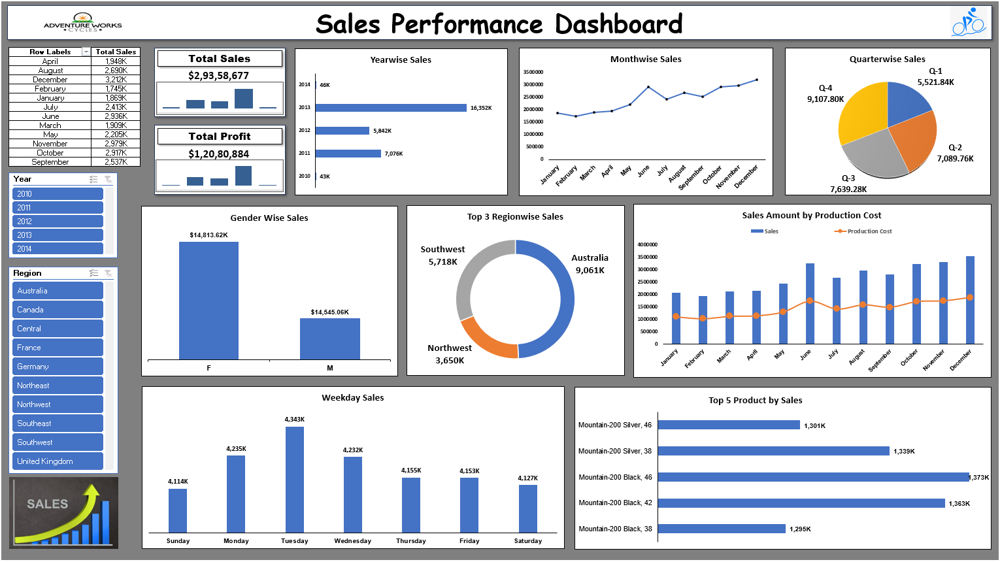

# Adventure Works Sales Analysis (Excel)

## 🔹 Project Overview
This project analyzes sales data using Excel to create dashboards and generate insights.

## 🔹 Tools Used
- Microsoft Excel

## 🔹 Key Objectives
- Analyze sales performance
- Identify top products and regions
- Track key KPIs

## 🔹 Key Insights
- Found top-performing products
- Identified high-revenue products
- Analyzed monthly sales trends

## 🔹 Dashboard Screenshots

## 🔹 Live Dashboard
[View Excel Dashboard](https://docs.google.com/spreadsheets/d/1VmpDYkvDrKVwL-hb2C3Wz6KphvlgT9OD/edit?usp=drive_link&ouid=105158460104170010841&rtpof=true&sd=true)

## 🔹 Conclusion
This project helps in understanding sales patterns and supports better decision-making.
