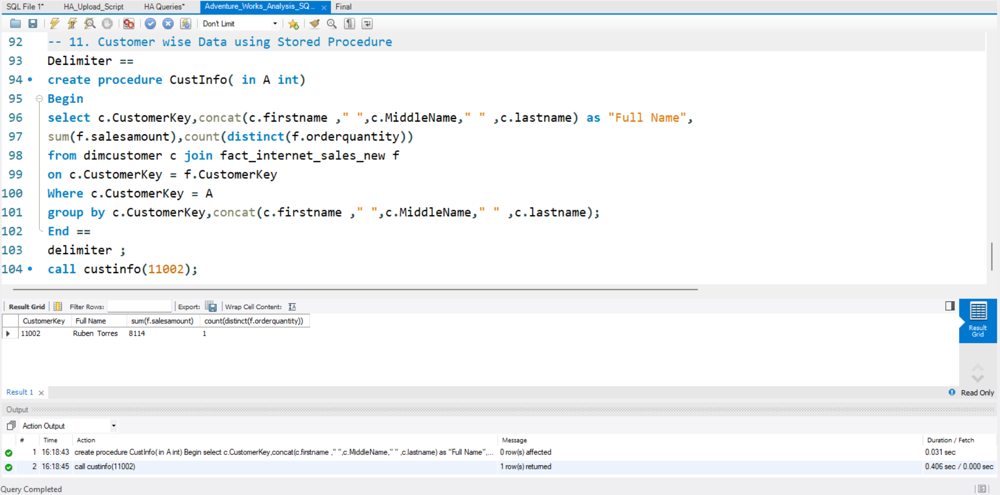
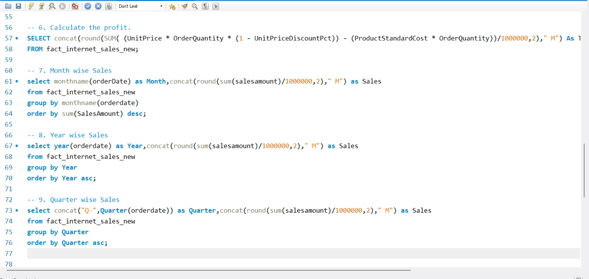
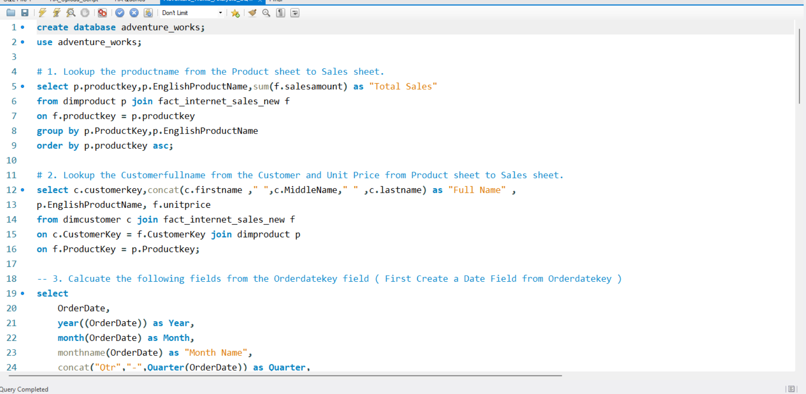

# Adventure Works Sales Analysis (SQL)

## Project Overview
This project uses **SQL (MySQL)** to analyze the Adventure Works sales dataset and extract meaningful business insights. It focuses on querying structured data to understand sales performance, trends, and patterns.

## Tools Used
- SQL (MySQL)

## Key Objectives
- Query and analyze sales data  
- Identify trends and patterns over time  
- Perform data aggregation and filtering  
- Generate insights to support business decisions  

## Query & Output Screenshots

## Key SQL Operations Performed
- Data filtering using `WHERE` clause  
- Aggregations using `SUM()`, `COUNT()`, `AVG()`  
- Grouping using `GROUP BY`  
- Sorting using `ORDER BY`  
- Joining multiple tables using `JOIN`  
- Using subqueries for deeper analysis  

## Key Insights
- Identified top-performing products and categories  
- Analyzed sales trends across different time periods  
- Compared performance across regions and customers  
- Derived insights to support data-driven decision-making  

## Conclusion
This project demonstrates how SQL queries can be effectively used to extract insights from raw data and support data-driven decision-making.
