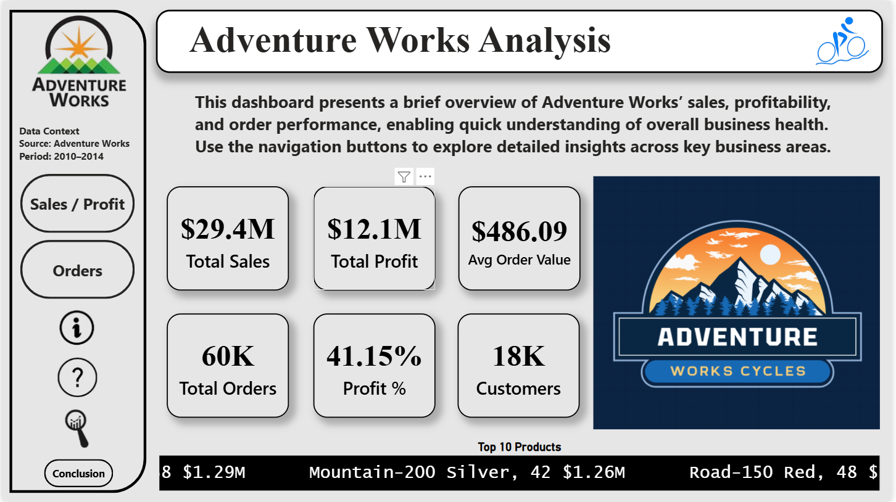
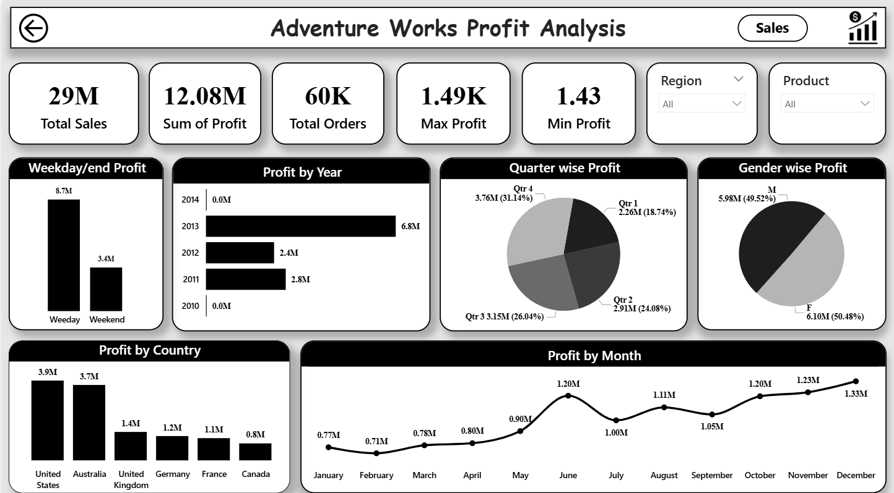

Adventure Works Power BI Dashboard

Project Overview
 This project presents an interactive Power BI dashboard built using the Adventure Works dataset. It provides a complete analysis of Sales, Orders, and Profit, helping to  understand overall business performance and trends through visual insights.

Tools & Technologies
 Power BI
 DAX (Data Analysis Expressions)
 Data Modeling

Key Objectives
 Analyze sales, profit, and order performance
 Identify top-performing products and regions
 Track key KPIs for business growth
 Understand trends across time (monthly, quarterly, yearly)

Key KPIs
 Total Sales: 29M+
 Total Profit: 12M+
 Total Orders: 60K+
 Average Order Value
 Profit Percentage
 Customer Count

Dashboard Features
 Sales, Orders, and Profit Analysis in separate views
 Country-wise performance comparison
 Month-wise and Year-wise trend analysis
 Gender-based customer insights
 Weekday vs Weekend performance
 Interactive filters (Region & Product)

Key Insights
 Sales peak during mid-year and year-end months
 Weekday performance is significantly higher than weekends
 United States and Australia generate the highest revenue
 A small set of products contributes to major sales
 Profit trends closely follow sales growth patterns

Dashboard Screenshots

How to Use
 1. Download the .pbix file from the repository
 2. Open it in Power BI Desktop
 3. Use filters to explore different regions and products
 4. Navigate across dashboards for deeper insights

Conclusion
 This dashboard simplifies complex business data into meaningful insights. It helps in identifying trends, tracking performance, and making data-driven decisions     effectively.
