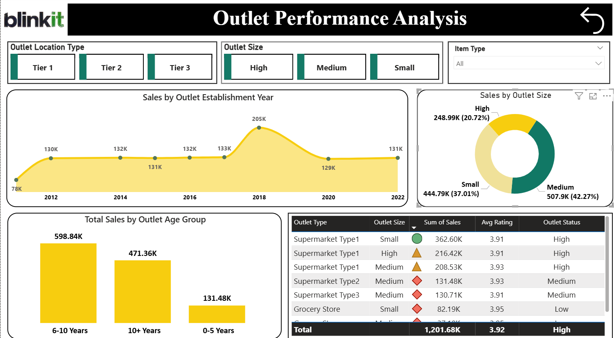
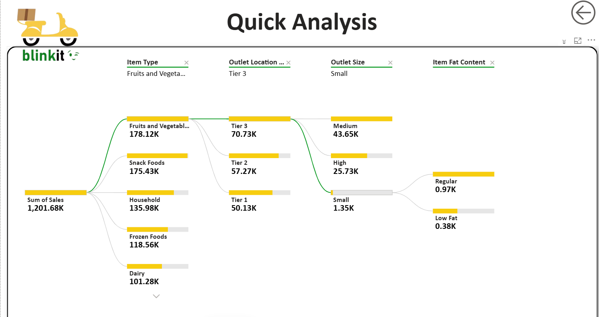

# Blinkit Sales Performance Dashboard (Power BI)

## Overview
This project showcases an **interactive Power BI dashboard** built to analyze Blinkit's sales performance across products, outlets, and customer behavior.

## Dashboard Preview

## Executive Overview

## Product & Sales Analysis

## Outlet Performance

## Quick Analysis

## Key Insights & Recommendations

## Objectives
- Analyze overall sales performance  
- Identify top-performing product categories  
- Evaluate outlet performance  
- Understand customer preferences  

## Key Metrics
-  Total Sales: **1.20M**  
-  Avg Rating: **3.92**  
-  Avg Sales per Item: **140.99**  
-  Total Item Types: **16**  
-  Total Outlets: **10**  

## Key Insights
- Fruits & Vegetables & Snack Foods are top sellers  
- Low-fat products dominate sales  
- Tier 3 locations generate highest revenue  
- Medium outlets perform best  
- Ratings remain consistent (~3.9)  

## Business Recommendations
- Expand in Tier 3 locations  
- Focus on medium-sized outlets  
- Improve low-performing products  
- Leverage demand for low-fat items  

## Tech Stack
- Power BI  
- DAX  
- Excel / CSV  

## Project Structure
- [Power BI](./Power%20BI) – Interactive dashboards
- [Raw Data](./Raw%20Data) – Original dataset
