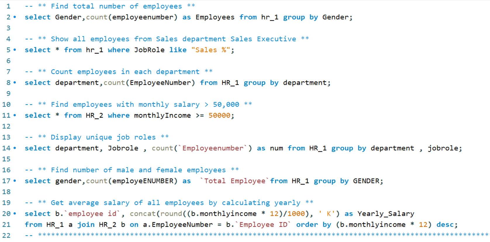
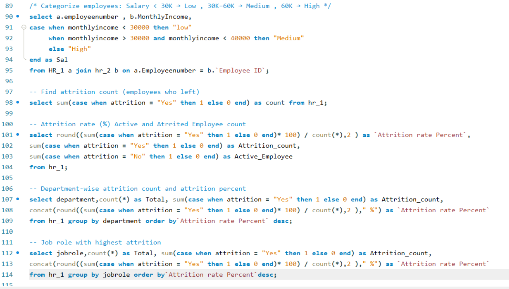
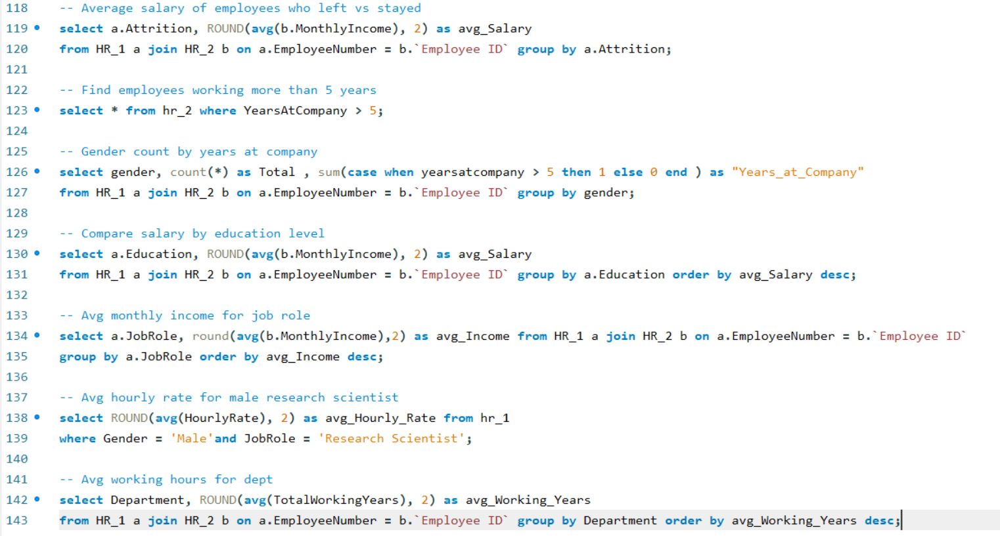

# HR Attrition Analysis (MySQL)

## Project Overview
This project focuses on analyzing **HR Attrition Data using MySQL** by writing SQL queries to extract meaningful insights.

The analysis covers employee distribution, salary trends, attrition patterns, department performance, and job role comparisons.

## Objectives
- Perform data analysis using SQL queries  
- Understand employee attrition trends  
- Analyze salary distribution and department performance  
- Compare employees based on job roles, experience, and education  
- Build strong SQL skills for real-world data analysis  

## Query Screenshots

 

 

  

  

## Dataset Description
The dataset is divided into two tables:

### HR_1
- EmployeeNumber  
- Department  
- JobRole  
- Gender  
- Attrition  
- Education  
- HourlyRate  

### HR_2
- Employee ID  
- MonthlyIncome  
- YearsAtCompany  
- TotalWorkingYears  

## Key SQL Analysis Performed

### Basic Analysis
- Total employees by gender  
- Employees by department  
- Unique job roles  
- Employees with high salary (>50K) 

### Salary Analysis
- Average monthly and yearly salary  
- Top 5 highest paid employees  
- Salary by job role  
- Department with highest average salary  
- Total salary expense per department 

### Attrition Analysis
- Total attrition count  
- Attrition rate (%)  
- Department-wise attrition  
- Job role with highest attrition  
- Salary comparison of employees who left vs stayed 

### Employee Insights
- Employees working more than 5 years  
- Gender distribution based on experience  
- Salary comparison by education level  
- Average income by job role  
- Average working years by department 

### Advanced Analysis
- Categorized employees based on salary:
  - Low (<30K)  
  - Medium (30K–60K)  
  - High (>60K)  

- Self join to find employees with same job roles 

## Key Insights
- Highest attrition observed in certain job roles and departments  
- Salary distribution helps identify high-paying roles  
- Employees with more experience show different attrition patterns  
- Department-wise salary expense gives cost insights  
- Education level impacts average salary 

## Tools & Technologies Used
- **MySQL**
- SQL (Joins, Aggregations, CASE, GROUP BY, ORDER BY)
- Data Analysis

## How to Use
1. Import both datasets into MySQL  
2. Create tables: `HR_1` and `HR_2`  
3. Run the SQL queries from the project  
4. Modify queries for deeper insights 

## Skills Demonstrated
- SQL Query Writing  
- Data Cleaning & Transformation  
- Joins (Inner Join, Self Join)  
- Aggregations & Grouping  
- Business Insights Generation 
