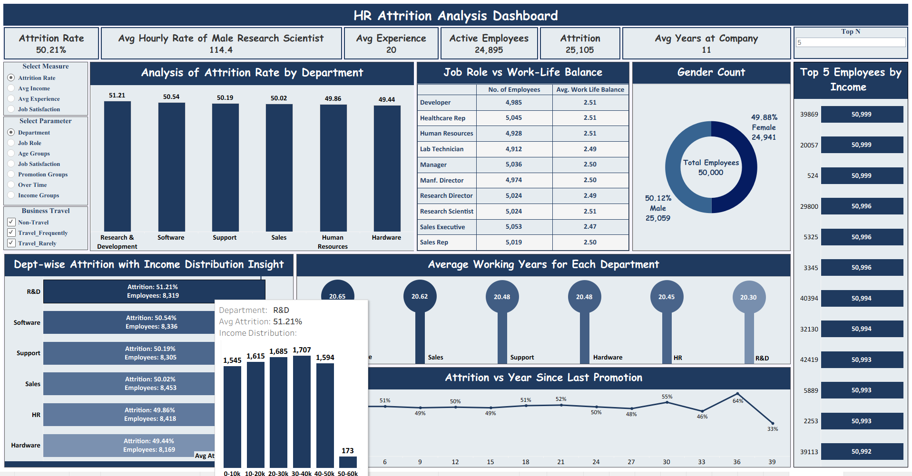

# HR Attrition Analysis Dashboard (Tableau)

## Project Overview
This project is an interactive **HR Attrition Analysis Dashboard** created using **Tableau** to analyze employee attrition, workforce trends, salary distribution, and department performance.

The dashboard helps in understanding key factors affecting employee turnover and supports data-driven HR decisions.

## Objectives
- Analyze employee attrition across departments  
- Track workforce KPIs in a single view  
- Understand impact of salary, experience, and promotion on attrition  
- Compare job roles and work-life balance  
- Identify high attrition areas  

## Dashboard Preview

## Key KPIs
- **Attrition Rate:** 50.21%  
- **Avg Hourly Rate (Male Research Scientist):** 114.4  
- **Avg Experience:** 20 Years  
- **Active Employees:** 24,895  
- **Attrition Count:** 25,105  
- **Avg Years at Company:** 11 

## Dashboard Features

### Filters / Controls
- Select Measure (Attrition Rate, Avg Income, Avg Experience, Job Satisfaction)  
- Select Parameter (Department, Job Role, Age Group, Promotion Group, Income Group)  
- Business Travel Filter 

### Visuals Included

#### Attrition Rate by Department  
Bar chart showing attrition percentage across departments.

#### Job Role vs Work-Life Balance  
Table showing number of employees and average work-life balance per role.

#### Gender Distribution  
Donut chart showing male vs female employee ratio.

#### Top 5 Employees by Income  
Highlights highest earning employees.

#### Department-wise Attrition with Income Distribution  
Shows attrition along with income distribution for each department.

#### Average Working Years by Department  
Displays experience level across departments.

#### Attrition vs Years Since Last Promotion  
Line chart showing relation between promotion gap and attrition.

## Key Insights
- Attrition rate is around **50% across all departments**  
- **R&D department** has slightly higher attrition  
- Work-life balance is almost consistent across job roles  
- Employee experience is around **20 years on average**  
- Attrition increases with certain promotion gaps  
- Gender distribution is almost equal 

## Tools & Technologies Used
- **Tableau**
- Data Visualization
- Dashboard Design
- Data Analysis

## Skills Demonstrated
- HR Analytics  
- Dashboard Development  
- Data Visualization  
- KPI Analysis  
- Business Intelligence  
- Storytelling with Data  
