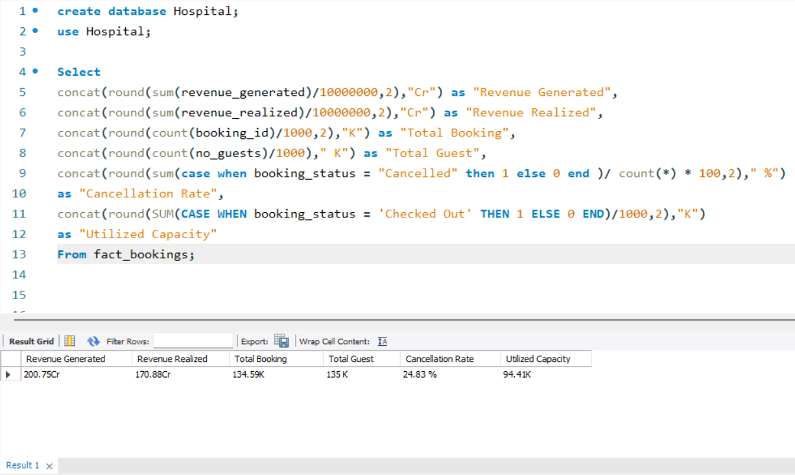
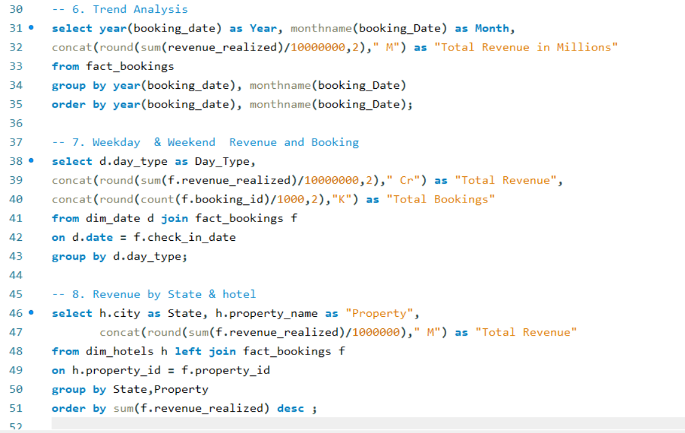
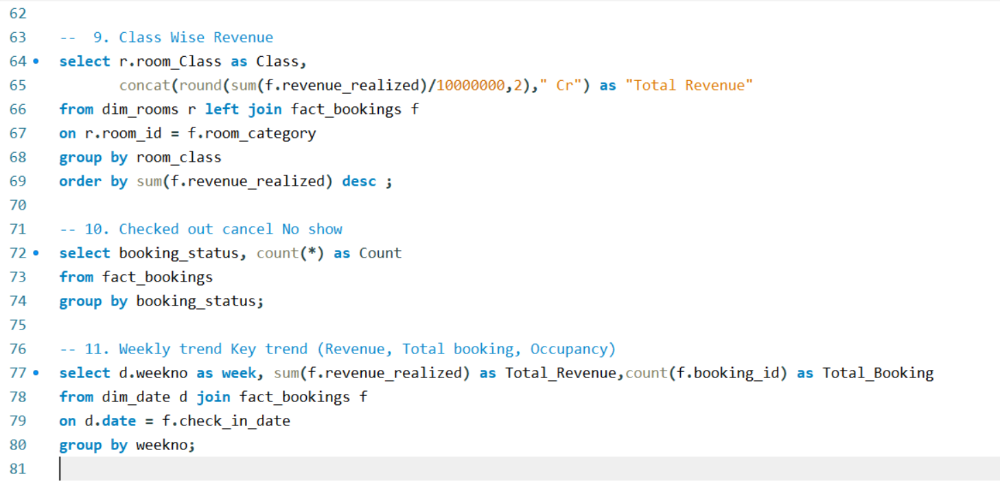

#  SQL Projects

This folder contains my SQL-based data analysis projects focused on extracting insights from raw data using structured queries.

## Featured Project: Hospitality Data Analysis

### Project Overview
This project analyzes hospitality booking data using SQL to generate key business insights such as revenue, bookings, occupancy, and cancellation trends.

## Tools Used
- SQL (MySQL)

## Key Analysis Performed
- KPI calculation (Revenue, Bookings, Occupancy, Cancellation Rate)
- Time-based analysis (Monthly & Weekly trends)
- Weekday vs Weekend performance comparison
- Revenue analysis by city and hotel
- Room class performance analysis
- Booking status analysis (Checked-out, Cancelled, No-show)

## SQL Query & Output Screenshots

### KPI Metrics

---
### Trend & Revenue Analysis

---
### Class & Booking Insights

---
## SQL Concepts Used
- Aggregation Functions (SUM, COUNT, AVG)
- GROUP BY & ORDER BY
- CASE WHEN statements
- Joins (INNER JOIN, LEFT JOIN)
- Date functions (YEAR, MONTH)
- Data formatting (ROUND, CONCAT)

## Key Insights
- High revenue generated from premium and elite room categories
- Weekend bookings contribute significantly to revenue
- Certain cities (like Mumbai) generate higher revenue
- Cancellation rate (~25%) impacts overall performance
- Weekly trends help identify peak booking periods

## Conclusion
This project demonstrates how SQL can be used to perform end-to-end data analysis, from data extraction to generating meaningful business insights.

⭐ This project highlights my ability to write optimized SQL queries and analyze real-world datasets effectively.
