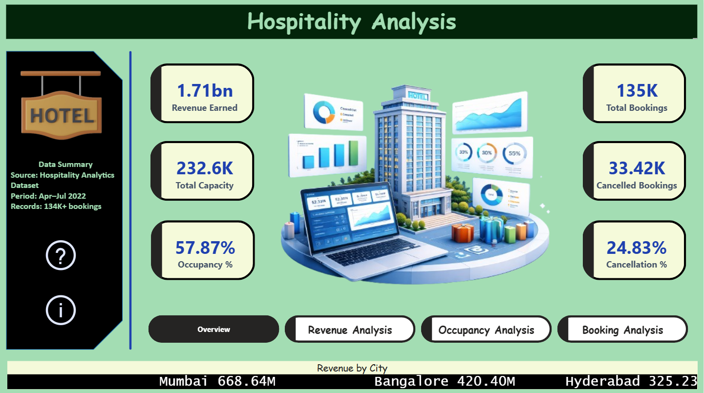
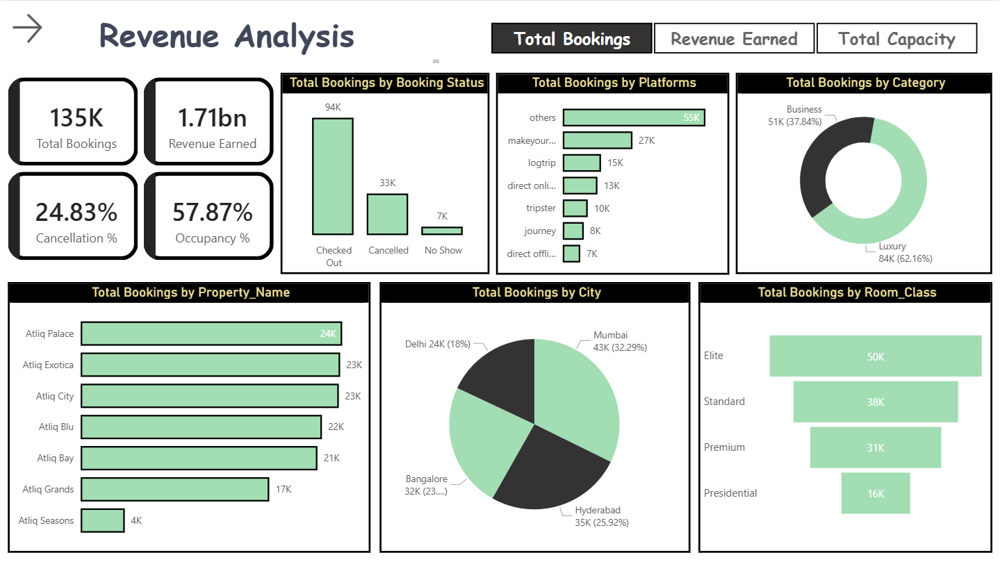
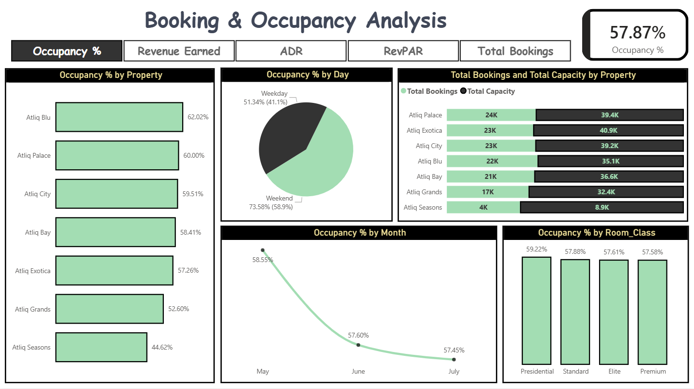
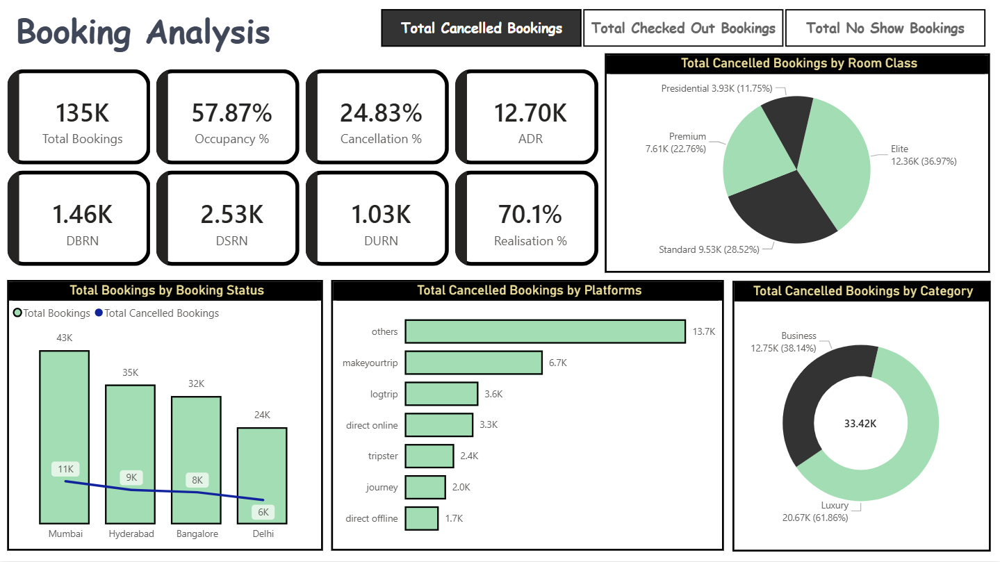
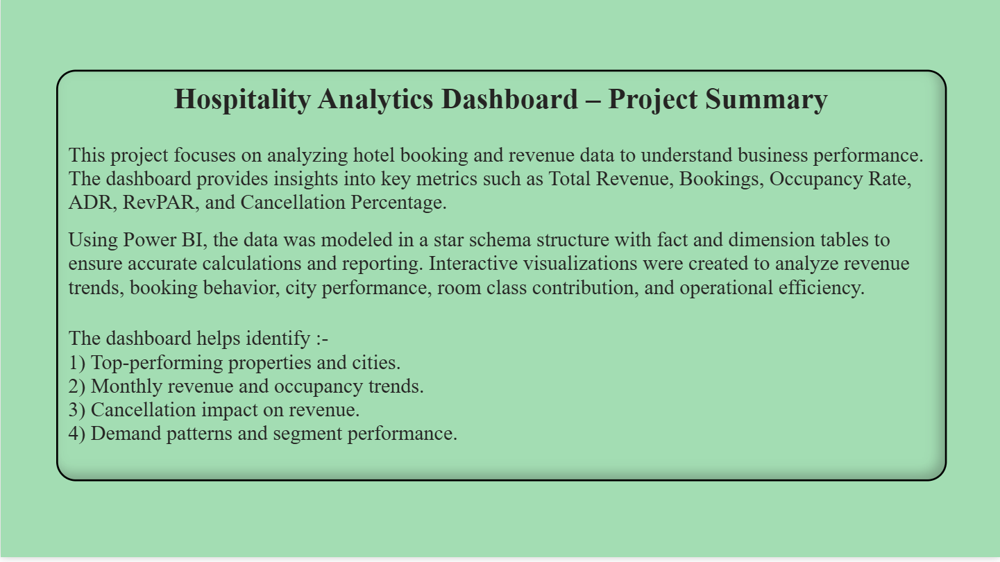

#  Hospitality Analytics Dashboard (Power BI)

## Project Overview
This project analyzes hospitality data to evaluate hotel performance, bookings, and revenue trends.

## Tools Used
- Power BI

## Key Objectives
- Analyze occupancy rates
- Track revenue and bookings
- Identify seasonal trends

## Key Insights
- Identified peak booking periods
- Found high-revenue customer segments
- Analyzed occupancy and cancellation trends

## Dashboard Screenshots

## Conclusion
This dashboard helps improve decision-making in the hospitality industry by analyzing performance and trends.
