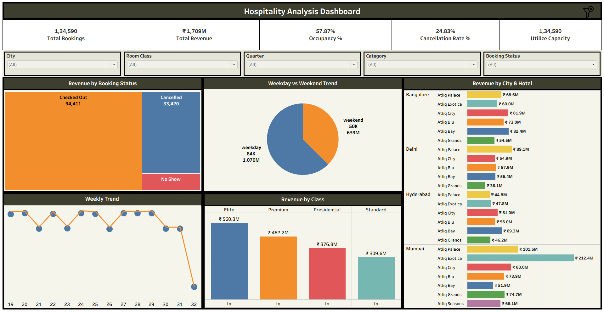

#  Tableau Projects

This folder contains my Tableau dashboard projects focused on data visualization and business insights.

## Featured Project: Hospitality Analysis Dashboard

### Project Overview
This dashboard analyzes hospitality data to track bookings, revenue, occupancy, and cancellation trends across different cities and hotels.

## Key Highlights
-  Total Bookings: 134K+
-  Total Revenue: ₹1.7B+
-  Occupancy Rate: 57.87%
-  Cancellation Rate: 24.83%

## Dashboard Preview

## Tools Used
- Tableau
- Data Visualization Techniques

## Insights Generated
- Identified high-revenue cities like Mumbai and Bangalore
- Analyzed weekday vs weekend booking trends
- Found cancellation patterns impacting revenue
- Compared performance across hotel categories

This project demonstrates my ability to build interactive dashboards and derive actionable insights from data
