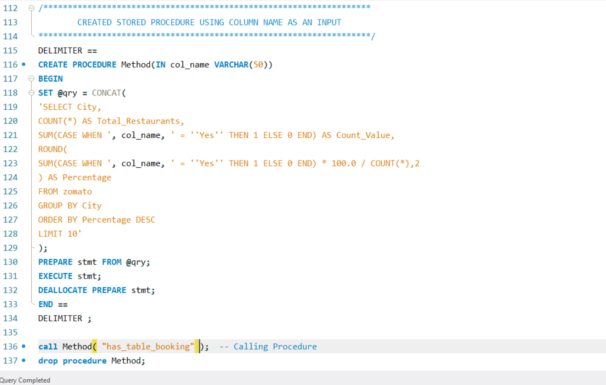
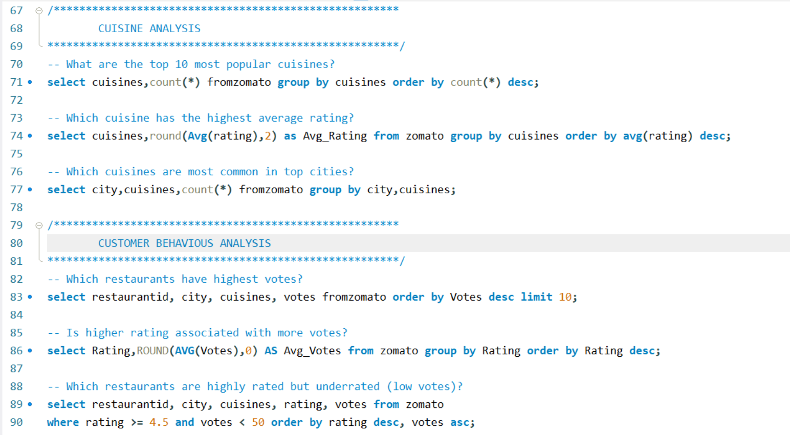
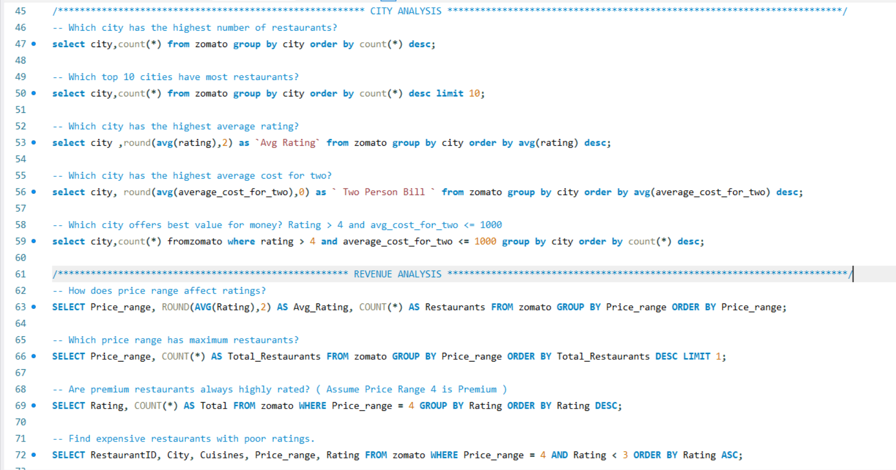

# Zomato Restaurant Analytics (MySQL)

## Project Overview
This project focuses on analyzing **Zomato Restaurant Data using MySQL** by writing SQL queries, creating views, and using stored procedures to extract meaningful insights.

The analysis covers restaurant distribution, cuisines, pricing trends, customer behavior, and service availability such as online delivery and table booking.

## Objectives
- Perform data analysis using SQL queries  
- Understand restaurant distribution across cities and countries  
- Analyze pricing and rating trends  
- Study customer behavior using votes and ratings  
- Evaluate delivery and table booking services  
- Build strong SQL skills with real-world dataset 

## Query Screenshots

  
  
  
  
 
 

## Dataset Description
The dataset contains restaurant-level information:

- Restaurant ID  
- City  
- Country Code  
- Cuisines  
- Average Cost for Two  
- Rating  
- Votes  
- Has Online Delivery  
- Has Table Booking 

## Key SQL Analysis Performed

### Basic Analysis
- Total restaurants  
- Total cities and countries  
- Total cuisines  
- Total votes  
- Average rating and cost for two 

### KPI View Creation
- Created a **view** to summarize:
  - Total restaurants  
  - Total cities & countries  
  - Average rating  
  - Average cost  
  - Online delivery %  
  - Table booking % 

### Stored Procedure (Dynamic Analysis)
- Created a **stored procedure** to:
  - Pass column name dynamically  
  - Calculate:
    - Total restaurants  
    - Count of "Yes" values  
    - Percentage distribution  
- Used for:
  - Online Delivery analysis  
  - Table Booking analysis 

### Delivery & Booking Analysis
- Restaurants with table booking vs without  
- Average cost comparison  
- Restaurants offering both services  
- Top cities with both delivery & booking  
- Cities with highest table booking 

### Cuisine Analysis
- Top cuisines by restaurant count  
- Highest rated cuisines  
- Cuisine distribution across cities 

### Customer Behaviour Analysis
- Most voted restaurants  
- Rating vs average votes  
- Highly rated but low-vote (underrated) restaurants 

## Key Insights
- Restaurants with **table booking are generally more expensive**  
- Only a small percentage offer **both delivery and booking services**  
- Few cuisines dominate the restaurant industry  
- High ratings do not always mean high votes  
- Some restaurants are **highly rated but underrated (low visibility)** 

## Tools & Technologies Used
- **MySQL**  
- SQL (Joins, Aggregations, Views, Stored Procedures)  
- Data Analysis 

## How to Use
1. Import dataset into MySQL  
2. Create the `zomato` table  
3. Run SQL queries from the project  
4. Execute:
   - KPI View  
   - Stored Procedure  
5. Analyze outputs and derive insights  

## Skills Demonstrated
- SQL Query Writing  
- View Creation  
- Stored Procedures  
- Aggregations & Grouping  
- Business Data Analysis  
