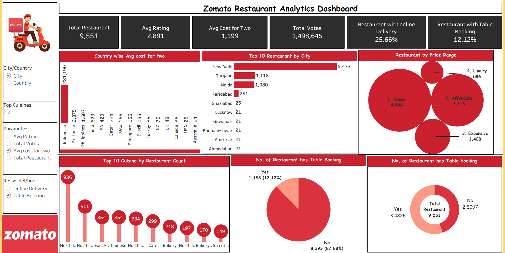

# Zomato Restaurant Analytics Dashboard

## Project Overview
This project presents an interactive **Zomato Restaurant Analytics Dashboard** built to analyze restaurant data, customer preferences, pricing, and service availability.

The dashboard provides insights into restaurant distribution, ratings, cost trends, cuisines, and service features like online delivery and table booking.

## Objectives
- Analyze restaurant distribution across cities and countries  
- Understand customer ratings and voting trends  
- Compare pricing and cost distribution  
- Identify popular cuisines  
- Evaluate service features like online delivery and table booking 

## Dashboard Preview

## Key KPIs
- **Total Restaurants:** 9,551  
- **Average Rating:** 2.891  
- **Average Cost for Two:** 1,199  
- **Total Votes:** 1,498,645  
- **Restaurants with Online Delivery:** 25.66%  
- **Restaurants with Table Booking:** 12.12% 

## Dashboard Features

### Filters / Controls
- City / Country selection  
- Top Cuisines filter  
- Parameter selection:
  - Avg Rating  
  - Total Votes  
  - Avg Cost for Two  
  - Total Restaurants  
- Service filter:
  - Online Delivery  
  - Table Booking 

## Visual Insights

### Country-wise Avg Cost for Two  
Displays average dining cost across different countries.

### Top 10 Restaurants by City  
Highlights cities with the highest number of restaurants.

### Restaurants by Price Range  
Categorizes restaurants into:
- Cheap  
- Affordable  
- Expensive  
- Luxury

### Top 10 Cuisines by Restaurant Count  
Shows most popular cuisines based on number of restaurants.

### Table Booking Availability  
Displays percentage of restaurants offering table booking.

### Online Delivery Insights  
Shows distribution of restaurants offering online delivery services.

## Key Insights
- Majority of restaurants fall under **cheap and affordable categories**  
- **New Delhi** has the highest number of restaurants  
- Only a small percentage offer **table booking services (~12%)**  
- Online delivery is available in around **25% of restaurants**  
- Certain cuisines dominate restaurant count 

## Tools & Technologies Used
- **Power BI / Tableau** (depending on your tool)  
- Data Visualization  
- Dashboard Design  
- Data Analysis

## How to Use
1. Open the dashboard file  
2. Use filters to explore data by city, cuisine, or service  
3. Analyze KPIs and visuals  
4. Derive insights for business understanding 

## Skills Demonstrated
- Data Visualization  
- Dashboard Development  
- KPI Analysis  
- Food & Restaurant Analytics  
- Business Intelligence 
